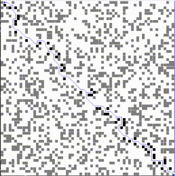

# Tue Sep 26 19:27:38 PDT 2023

I need to decide on the metrics to track.

- Collisions
- Cells virtually explored
- Travel length
- Optimal path length
- Execution time

To track the metric I'll set the metric values to 0. Update them through the run. And finally note themetric.

---
> endlog - Tue Sep 26 19:51:11 PDT 2023

## Tue Sep 26 15:18:19 PDT 2023

Implemented some more of Bee0.

It ignores blocks, and uses simple dijkstras. But it tracks multiple goals.

---
> endlog - Tue Sep 26 15:20:37 PDT 2023

## Mon Sep 25 14:37:40 PDT 2023

Dude caching makes this sooo much faster. Even the dijkstra's slow rover suddenly became really fast in low density mazes. This was a really small edit for a really cool boost. 

---
> endlog - Mon Sep 25 14:40:03 PDT 2023

## Sat Sep 23 01:41:59 PDT 2023

Rover3 is going to be Bee0.

This Bee will navigate a honeycomb (Hexagonal Grid). Furthermore it will have multiple goals instead of a single goal. The bee will have to decide for itself which goal it will want to go too first. 

Bee1 will start to cach its heuristic path as long as there are not block along that heuristic path. This is better than Rover2 which recomputes the heuristic path after every step.

---
> endlog - Sat Sep 23 01:57:50 PDT 2023

## Wed Sep 20 23:22:45 PDT 2023

Visualizing the heuristically explored path makes this look soo much cooler. Also Rover2 can swap between Dijkstra and A* with euclid distance heuristic. The heuristic makes the rover move soo much faster.

---
> endlog - Wed Sep 20 23:27:13 PDT 2023

## Wed Sep 20 20:36:42 PDT 2023

Here's an update. I'm calling Rover1 complete. Like Rover0 Rover1 uses a kind of A* or Dijkstra's path finding algorithm.

Here's the method.

The rover initially assumes that there are no blockades on the map. Under this assumption the rover plots the optimal route to the destination. Once plotted the rover takes a step on that route and repeats. If the rover is ever unable to take the step due to a blockade, the rover updates its assumptions on the existing blockades and tries again.

I initially thought this is good enough but then I realized there are points where the steps could be optimized. This is much more clearly visible when the grid size is increased so that the rover needs to plot much longer routes.

What we see is that the rover acts slowly when its charting a route from far away from the destination, and it acts faster when its charting a route from near the destination.

I know this can be optimized because I implemented the route charting using Dijkstra's algorithm. If I implement it using A* then the route charting will be faster. The funny thing is that this will technically be a heuristic on top of a heuristic. The first heuristic is Dijkstra's charting a route with reduced knowledge of the blockades. The second heuristic is the Manhattan distance from a point to the destination.

Also I should add in a visualization for the paths explored while searching for the heuristic path.

---
> endlog - Wed Sep 20 21:08:35 PDT 2023

## Tue Sep 19 17:03:17 PDT 2023

This looks fun. I cant belive I went so long without knowing about pygame!

---
> endlog - Tue Sep 19 17:05:11 PDT 2023
