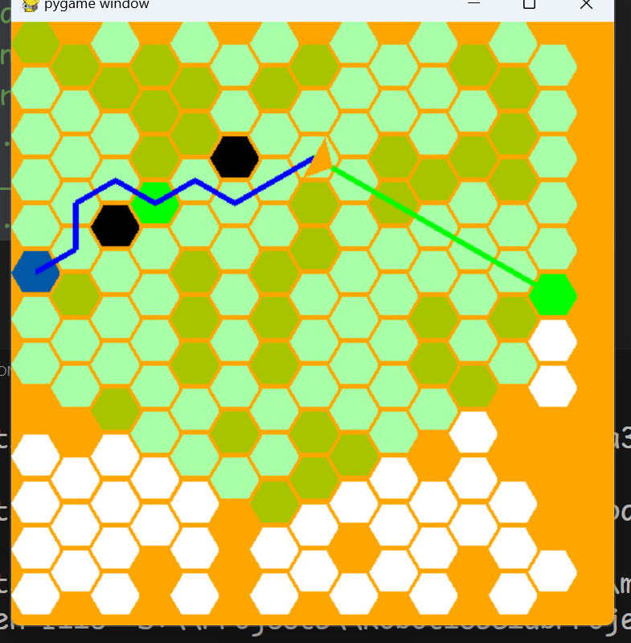

# Robotics club Trial Project
## Bee bot - Rahul Kandekar

In this project I implemented the navigation algorithm for a Bee to navigate through a hexagonal grid.

The program can be run by running the `Bestagon\main.py` script.

### Game GRID

When he script runs you will see a game screen open up and a bee will navigate from the BLUE Start Cell to visit all the GREEN End Cells.

On the Game pad you can manipulate density of the blocks using the UP and DOWN arrow keys.

You can also increase or decrease the refresh rate of the game event loop using the LEFT and RIGHT arrow keys.

Finally you can use the `-` and `+`or`=` keys to increase or decrease the size of the hexagonal cells to make the bee navigate a much larger grid.

### Bee Controls

Right click any cell to mark it as a starting point.

Left click a cell to add or remove it from the list of goals.

Press the `B` button to switch the Bees navigation algorithm between Dijkstra's and A* search

After the Bee has reached all goals press `M` to see and compare the shortest possible path to the actual path taken by the Bee

Press `I` to restart the Bee's run with perfect knowledge of all the blockades in the environment. This should result in the Bee following the Ideal Shortest path as shown by pressing the `M` key.

Press `ENTER` anytime to restart the scenario with a new random grid.

### Dijkstra's vs A*

When you make the Bee navigate a really large maze, the Bee starts to slow down. This is because the Bee spends a lot of computational effort to virtually explore a path along every cell that is highlighted in Green.

In Dijkstra's search you can see that the Bee virtually explores even those cells that are far and in the opposite direction from te goal. However in A* search the Bee only virtually explores a path in the direction of a goal. This allows the A* Bee to not waste any computation effort searching for a path via cells that are unlikely to be visited.

Once the Bee finds a virtual path to th goal (displayed in GREEN Line), It takes a step along that path. If the step is blocked then it accounts for the block in future virtual exploration.
